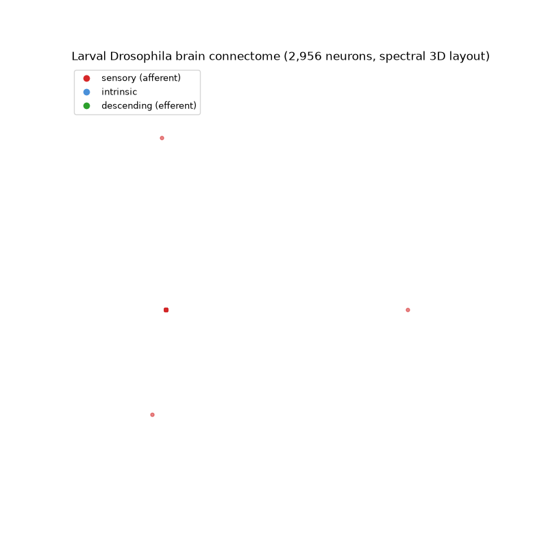
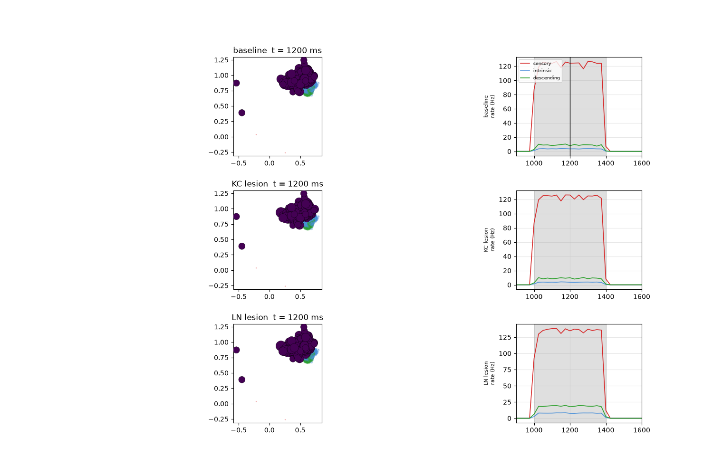

# FlyBrain — a larval Drosophila connectome, embodied in a MuJoCo fly

**The 60-second version.** Neuroscientists mapped the complete brain of a baby
fruit fly — 2,956 neurons and ~350,000 connections (Winding et al., *Science*,
2023). I brought that wiring diagram to life in a physics simulator. Each
neuron is a little "leaky bucket": it fills with input from its real
connections, and when it overflows it fires a spike that flows on to the
neurons it actually connects to. I put this brain inside a simulated adult
fly (flybody, DeepMind × Janelia). **Poke the fly's senses and the impulse
travels through real neural wiring to its legs — it kicks.** Remove a class of
neurons and the behavior changes. Crank up the gain and the brain seizes like
an epileptic fit. Give it aerodynamic wings and it hovers — poke it mid-air
and it keeps flying. Everything below is reproducible from this repository.

## Media
| | |
|---|---|
|  |  |
| the connectome in 3D (`brain_360.gif`) | lesion experiment, in the brain (`brain_lesions.gif`) |

More: `stabilize_hover_poke.gif` (stable hover + mid-air poke),
`embodied_fly.gif` (poke → leg kick), `seizure.gif` (seizure regime),
`composite_lesions.gif` (baseline \| KC lesion \| LN lesion side by side),
`experiment_battery.png`, `stability_curve.png`, `thrust_calib.png`,

## What it does
claw-touch sensors ──► sensory neurons (434)
│ connectome, gain 8 (stable regime)
▼
interneurons (1,598)
│
▼
descending neurons: DN-VNC (legs), DN-SEZ (head)
│
firing rates (low-pass) ──► joint targets (position servos)
▼
the fly moves


## Results
| condition | descending spikes during poke | most active leg | peak deviation |
|---|---|---|---|
| control (no poke) | 0 | — | 0.034 rad |
| poke RIGHT | 1,206 | T1_right (ipsilateral) | 0.490 rad |
| poke LEFT | 1,768 | T1_right | 0.711 rad |
| poke BOTH | 5,641 | T1_right | 0.988 rad |
| poke RIGHT + KC lesion (mushroom body) | 1,225 | T1_right | 0.514 rad |
| poke RIGHT + LN lesion (inhibitory) | **2,517** | T1_right | 0.539 rad |

- **KC lesion = null result**: the touch→leg reflex does not route through the
  mushroom body (KCs are olfactory/learning neurons) — a mechanism-backed
  negative result.
- **LN lesion = disinhibition**: removing the 110 inhibitory local
  interneurons doubles motor output (1,206 → 2,517) and recruits extra legs —
  an inhibitory gain-brake on the sensorimotor reflex.
- **Flight**: with flybody's aerodynamic wings, the fly hovers stably
  (passive aerodynamic stability, max tilt ~3–7°). Poked mid-air it fires
  ~7,400 descending spikes, kicks, and keeps flying. A "wind-tunnel" thrust
  calibration revealed a wing-stall cliff (~0.3 rad amplitude) that explains
  earlier chaotic takeoffs.

## Quickstart
```bash
python -m venv .venv && source .venv/bin/activate
pip install mujoco numpy matplotlib pillow

# connectome data (mirror of Winding et al. 2023)
mkdir -p data && cd data
curl -L -o fly_larva.zip "https://networks.skewed.de/net/fly_larva/files/fly_larva.csv.zip"
unzip fly_larva.zip && cd ..          # nodes.csv / edges.csv into data/

# fly body assets (flybody, Apache-2.0)
git clone --depth 1 https://github.com/TuragaLab/flybody   # run scripts from repo root

# the ladder
python toy_lif.py             # 2-neuron LIF tutorial
python explore_connectome.py  # meet the connectome
python lif_full_brain.py      # whole brain in a box
python embodied_fly.py        # brain in the fly: poke -> leg kick
python experiments.py         # the lesion/dose battery (~3 min)
python brain_360.py           # 3D connectome rotation GIF
python brain_viz_lesions.py   # lesion comparison in the brain
python flight_test.py         # flight + poke + seizure
python stabilize_video.py     # stable hover + poke video

Headless rendering: MUJOCO_GL=glfw xvfb-run -a python <script> --video
Repository layout

Brain models (toy_lif.py, lif_full_brain.py, lif_dales.py), data
exploration (explore_connectome.py), embodiment (embodied_fly.py,
experiments.py, body_check.py), visualizations (brain_360.py,
brain_viz.py, brain_viz_lesions.py), flight (flight_test.py,
stabilize2.py, stabilize_video.py, thrust_calib.py, wing_sweep.py,
money_shot.py), debugging artifacts (diagnose_saturation.py,
sat_check.py), NOTES.md (full lab notebook).
Data provenance & modeling assumptions

    Connectome: Winding et al., The connectome of an insect brain, Science 379
    (2023) — 3,016 neurons / ~548k synapses. This repo uses the
    networks.skewed.de mirror (2,956 neurons / 352,611 synapses).
    Neurons: LIF (τ = 10 ms, τ_syn = 2 ms, θ = 1, 2 ms refractory; normalized
    units). Synapse counts → weights via row normalization × global gain
    (synaptic scaling); gain 8 from the stability analysis.
    Dale's-law signs from the larval literature where known (MBON, LN
    inhibitory); unknown classes default excitatory (no public larva NT
    predictions exist).
    Embodiment: larva brain + adult body — a disclosed proof-of-concept
    mismatch. The brain-only dataset lacks the ventral nerve cord and per-leg
    sensory identity, so sensory pools are seeded but arbitrary partitions.

Limitations

LIF is fluctuation-dominated (conductance-based E/I is future work); synapse
counts ≠ physiological strengths; no plasticity/learning yet; scripted gait
(not RL); open-loop flapping (stability is passive, not active).
Citations

    Winding et al. 2023, Science 379, doi:10.1126/science.add9330
    flybody, DeepMind × Janelia, github.com/TuragaLab/flybody (Apache 2.0);
    Nature (2025), doi:10.1038/s41586-025-09029-4
    FlyGM (the adult-fly analogue of this idea), arXiv:2602.17997

License

Code: MIT. Body assets: Apache 2.0 (© DeepMind/TuragaLab). Connectome data:
Winding et al. 2023 (mirror via networks.skewed.de).
